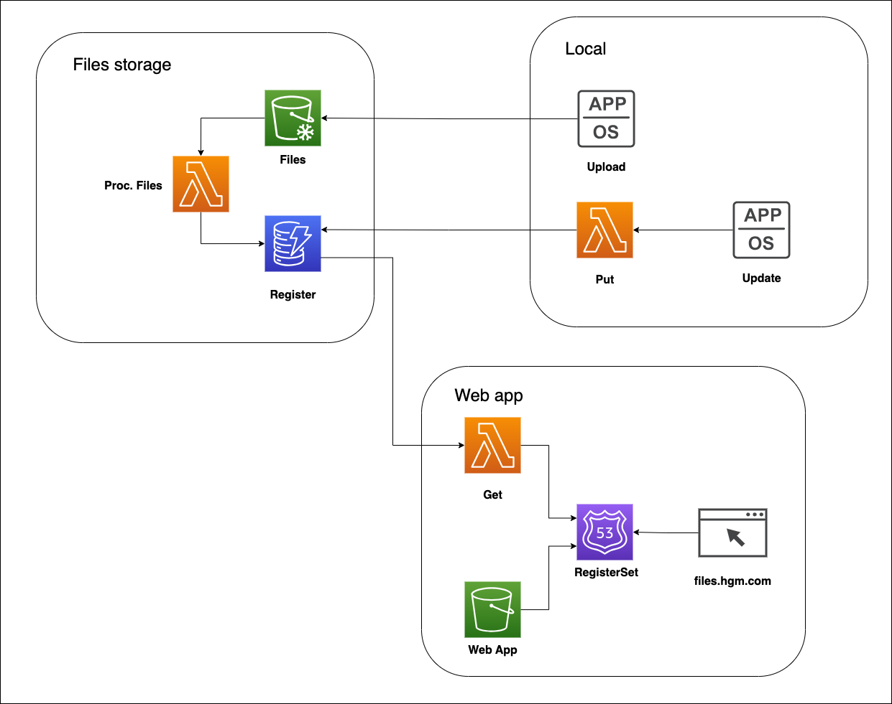

# File Storage

## About this project

Project developed to store pdf files in an architecture based on AWS services. This repository provides sample scripts and templates of my solution for storing, processing and managing files in AWS.

### Built with

    

## Architecture



## Setup

To setup this project an AWS Account is needed.

### File storage

1. Upload lambda templates to a S3 Bucket.
2. Replace placeholders for DynamoDB Table and S3 Buckets on CloudFormation template.
3. Open CloudFormation and create a stack from the template.
4. Save the output links from the CF stack.

### Local

1. Use AWS Access Keys as environment variables

2. Run scripts

#### Upload file to storage

```sh
node upload-file.js file.pdf
```

#### Update file status

```sh
node update-file.js file.pdf
```

(Note: scripts can be added as a context menu shortcut with [Custom Context Menu](https://github.com/ikas-mc/ContextMenuForWindows11?tab=readme-ov-file))

<h3>Web app</h3>

1. Install dependencies.

```sh
npm i
```

2. Create .env file with your get lambda endpoint

```
VITE_LAMBDA_GET_ENDPOINT = "<YOUR-URL>"
```

3. Build the React app.

```sh
npm run build
```

4. Create S3 Bucket for the static website and upload your build. ([Tutorial: Configuring a static website on Amazon S3](https://docs.aws.amazon.com/AmazonS3/latest/userguide/HostingWebsiteOnS3Setup.html))

5. Configure Route 53 subdomain for the website. ([Tutorial: Configuring a static website using a custom domain registered with Route 53](https://docs.aws.amazon.com/AmazonS3/latest/userguide/website-hosting-custom-domain-walkthrough.html#root-domain-walkthrough-configure-bucket-permissions))
